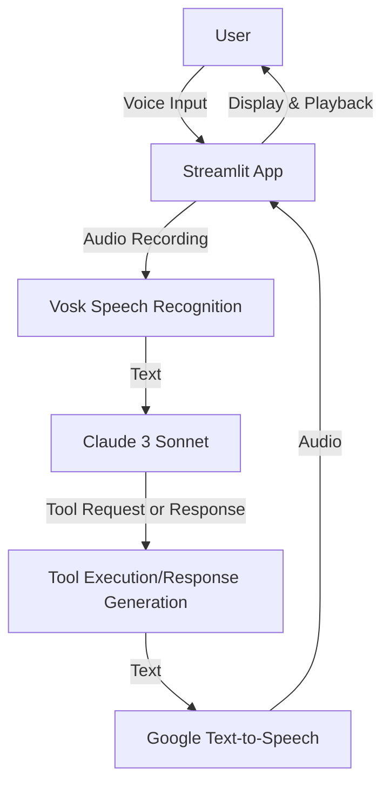
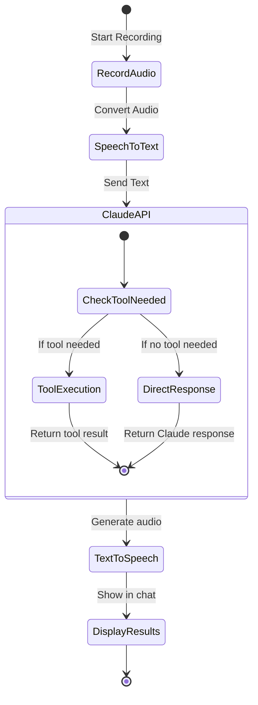
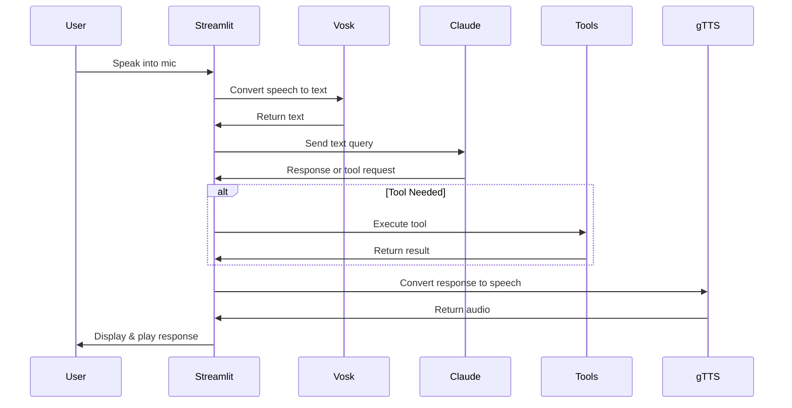

# Voice Assistant with Claude

A Streamlit-based voice assistant that uses speech recognition, Claude 3 Sonnet, and text-to-speech to create an interactive conversational experience. The assistant can handle queries about time, weather, and general questions.

## Architecture

### High-Level System Design



### Tool Processing Flow



### Message Processing Sequence



## Setup Instructions

### Prerequisites

- Python 3.8 or higher
- AWS account with Bedrock access
- AWS credentials configured locally

### Installation

1. Clone the repository:

```bash
git clone <repository-url>
cd voice-assistant
```

2. Create and activate virtual environment:

```bash
python -m venv venv
source venv/bin/activate  # On Windows: venv\Scripts\activate
```

3. Install dependencies:

```bash
pip install streamlit sounddevice vosk gtts boto3 pytz numpy wave
```

4. Install PortAudio (system dependency for sounddevice):

- On macOS:
  ```bash
  brew install portaudio
  ```
- On Ubuntu/Debian:
  ```bash
  sudo apt-get install portaudio19-dev python3-pyaudio
  ```
- On Windows:
  - PortAudio usually comes with Python sounddevice

### Configuration

1. Configure AWS credentials:

```bash
aws configure
```

Enter your AWS access key, secret key, and set region to `us-east-1`

2. Set up Bedrock access:

- Ensure your AWS account has Bedrock enabled
- Request access to Claude 3 Sonnet model

## Running the App

```bash
streamlit run voice_assistant.py
```

Visit http://localhost:8501 in your browser.

## Features

- 🎤 Voice input through microphone
- 🗣️ Speech-to-text conversion using Vosk
- 🤖 Natural language processing with Claude 3 Sonnet
- 🛠️ Built-in tools for:
  - Getting current time in different cities
  - Checking weather conditions
- 🔊 Text-to-speech response playback
- 💬 Chat interface with message history

## Troubleshooting

### Common Issues

1. **Microphone not working**

   - Check microphone permissions in browser
   - Verify correct audio input device selected
   - Use "Check Microphone" button to list available devices

   ```python
   # Check audio devices
   import sounddevice as sd
   print(sd.query_devices())
   ```

2. **Speech Recognition Issues**

   - Ensure Vosk model is downloaded successfully
   - Check audio recording format (should be WAV, 16kHz, mono)
   - Verify microphone input level

3. **AWS/Bedrock Issues**

   - Verify AWS credentials are configured correctly
   - Check Bedrock service quotas and limits
   - Ensure Claude 3 Sonnet model access is approved

4. **Text-to-Speech Issues**
   - Check internet connection (gTTS requires internet)
   - Verify temp directory write permissions
   - Check audio output device settings

### Error Messages and Solutions

| Error                            | Possible Cause                 | Solution                                              |
| -------------------------------- | ------------------------------ | ----------------------------------------------------- |
| `No module named 'vosk'`         | Missing dependency             | Run `pip install vosk`                                |
| `PortAudio not found`            | Missing system dependency      | Install PortAudio using system package manager        |
| `ValidationException` in Bedrock | Incorrect request format       | Check request body structure and tool definitions     |
| `No speech detected`             | Low microphone volume or noise | Adjust microphone settings or reduce background noise |

### Logging

The app includes detailed logging for debugging:

- Request/response bodies from Claude
- Tool execution details
- Speech recognition results

Enable debug logging by setting environment variable:

```bash
export STREAMLIT_LOG_LEVEL=debug
```

## Performance Optimization

1. **Speech Recognition**

   - Use appropriate Vosk model size based on needs
   - Consider caching recognized text

2. **Claude API**

   - Set appropriate max_tokens
   - Use system prompt to guide response length
   - Cache similar queries if possible

3. **Audio Processing**
   - Adjust recording duration as needed
   - Consider local TTS alternatives for faster response

## Contributing

Please read CONTRIBUTING.md for details on our code of conduct and the process for submitting pull requests.

## License

This project is licensed under the MIT License - see the LICENSE.md file for details.
